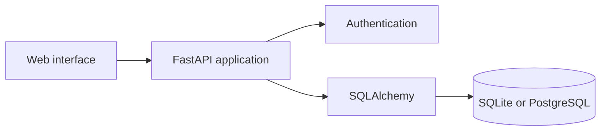

# Smart Carpool

A web application for managing university carpools, from publishing a route to confirming a booking between a driver and a passenger.

[Open the live demo](https://smart-carpool-7ltw.onrender.com)

> The demo uses a free hosting plan. Its first request after a period of inactivity may take about one minute while the service starts.

## Project status

The MVP is functional, published and validated with different users. It was developed from UniCar, a mobile prototype created as a final undergraduate project at UNIFAL-MG.

The demo accounts and records are fictitious. The application demonstrates the implemented workflows and business rules, but it is not offered as a service for everyday use.

## Features

- Account registration, authentication and profile editing
- Vehicle registration, selection, editing and safe deletion
- Ride publishing and search
- Booking requests from passengers
- Request approval or rejection by drivers
- Booking and ride cancellation
- Transaction-safe seat availability updates
- Dashboards for offered rides, requested rides and incoming requests
- Phone number and license plate protection before booking approval
- Interactive API documentation

## Business rules and validation

The application blocks operations that would leave its data inconsistent. Examples include deleting a vehicle linked to an active ride, accepting more passengers than the available capacity or modifying another user's request.

Manual tests with different accounts covered the booking negotiation, license plate privacy, profile editing, vehicle deletion rules and seat availability. In addition, 18 automated tests cover authentication, authorization, database behavior, vehicles, bookings, cancellations and data privacy.

```bash
pytest
```

## Technical overview

- FastAPI, Pydantic and SQLAlchemy
- PostgreSQL in the published environment and SQLite for local development
- Alembic database migrations
- HTML, CSS and JavaScript interface
- Pytest and HTTPX test suite
- GitHub Actions continuous integration



## Run locally

Python 3.11 or newer is required.

```bash
python -m venv .venv
```

On Windows:

```powershell
.venv\Scripts\Activate.ps1
pip install -r requirements.txt
python -m alembic upgrade head
python -m app.seed
uvicorn app.main:app --reload
```

On Linux or macOS:

```bash
source .venv/bin/activate
pip install -r requirements.txt
python -m alembic upgrade head
python -m app.seed
uvicorn app.main:app --reload
```

The application is available at `http://127.0.0.1:8000`, and its API documentation at `http://127.0.0.1:8000/docs`.

Demo accounts:

- `motorista@unifal.br` / `123456`
- `passageiro@unifal.br` / `123456`

On Windows, `start-smart-carpool.bat` also prepares the local application. The interface depends on the API and should not be opened directly from `app/static/index.html`.

## Documentation

- [`docs/architecture.md`](docs/architecture.md): main entities and seat availability rules
- [`docs/screens.md`](docs/screens.md): interface evolution from UniCar
- [`docs/roadmap.md`](docs/roadmap.md): completed work and optional improvements

## Background

Developed by Leonardo Henrique Oliveira from the final undergraduate project **UniCar: a shared carpooling application for the Federal University of Alfenas**, written with Bruna Helena Antonialli Gomes under the supervision of Professor Luiz Felipe Ramos Turci.

Additional security, privacy, moderation and operational reviews would be required before any real-world use.
