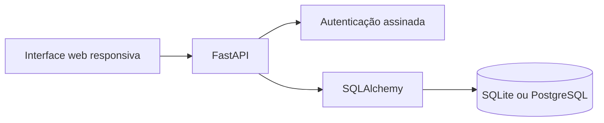

# Smart Carpool

Plataforma web de caronas universitárias inspirada no **UniCar**, protótipo desenvolvido como Trabalho de Conclusão de Curso na UNIFAL-MG. O projeto transforma a validação acadêmica feita no MIT App Inventor e Firebase em uma aplicação web com API, banco relacional, regras de negócio e testes automatizados.

> Status: `v0.1 - MVP demonstrável`. Projeto de portfólio em evolução; não é um serviço em produção.

## O problema

Estudantes que percorrem trajetos semelhantes nem sempre conseguem encontrar caronas de forma organizada e segura. O Smart Carpool centraliza a oferta, a busca e a confirmação de vagas, preservando os dados de contato até que o motorista aceite a solicitação.

## O que o MVP entrega

- Cadastro e autenticação de usuários
- Cadastro e seleção dos veículos de cada motorista
- Publicação e busca de caronas
- Solicitação de vaga pelo passageiro
- Aceite ou recusa pelo motorista
- Controle transacional de vagas disponíveis
- Painel de viagens oferecidas, solicitadas e pedidos recebidos
- Cancelamento de solicitações com devolução automática da vaga
- Cancelamento de caronas e encerramento das solicitações vinculadas
- Privacidade de telefone e placa antes do aceite
- Interface web responsiva e documentação interativa da API

## Tecnologias

- FastAPI e Pydantic
- SQLAlchemy
- Alembic para migrações do banco
- Psycopg 3 para PostgreSQL
- SQLite no desenvolvimento e compatibilidade com PostgreSQL
- HTML, CSS e JavaScript sem framework
- Pytest e HTTPX

## Executar localmente

Requer Python 3.11 ou superior.

Depois de configurar o ambiente, no Windows você também pode abrir o arquivo
`start-smart-carpool.bat`. Ele inicia o servidor e abre o endereço correto no
navegador. Não abra `app/static/index.html` diretamente e não use o Live Server,
pois a interface depende da API do FastAPI.

```bash
python -m venv .venv
```

No Windows:

```powershell
.venv\Scripts\Activate.ps1
pip install -r requirements.txt
python -m alembic upgrade head
python -m app.seed
uvicorn app.main:app --reload
```

No Linux ou macOS:

```bash
source .venv/bin/activate
pip install -r requirements.txt
python -m alembic upgrade head
python -m app.seed
uvicorn app.main:app --reload
```

Acesse `http://127.0.0.1:8000`. A documentação da API fica em `http://127.0.0.1:8000/docs`.

Contas de demonstração:

- `motorista@unifal.br` / `123456`
- `passageiro@unifal.br` / `123456`

## Testes

```bash
pytest
```

Os dez testes cobrem autenticação, conexão com o banco, isolamento dos veículos
de cada usuário, solicitação e aceite, autorizações, cancelamentos, controle de
vagas e privacidade dos dados de contato.

## Configuração para publicação

As variáveis necessárias estão documentadas em `.env.example`. Em produção,
configure `APP_ENV=production`, uma `SECRET_KEY` longa e a `DATABASE_URL` do
PostgreSQL. Antes de iniciar uma nova versão, execute:

```bash
python -m alembic upgrade head
python -m app.seed
```

O endpoint `/api/health` confirma que a aplicação consegue consultar o banco.
O `Dockerfile` executa as migrações, prepara os dados demonstrativos e inicia a
aplicação usando a porta fornecida pela hospedagem. O GitHub Actions executa os
testes a cada envio para a branch principal e em pull requests.

## Arquitetura



Veja também:

- [`docs/architecture.md`](docs/architecture.md) - entidades e regra crítica de vagas
- [`docs/screens.md`](docs/screens.md) - evolução das telas do UniCar
- [`docs/roadmap.md`](docs/roadmap.md) - próximas entregas planejadas

## Evolução do projeto

Este repositório registra a passagem de um protótipo acadêmico para um produto de portfólio. Cada versão deve ter um objetivo verificável:

- `v0.1`: MVP funcional, documentado e testado
- `v0.2`: edição e cancelamento de caronas, estados de interface e acessibilidade
- `v0.3`: PostgreSQL, migrações, conteinerização e publicação de uma demonstração

## Autores e origem

Projeto de portfólio de Leonardo Henrique Oliveira, baseado no TCC **UniCar: um aplicativo de caronas compartilhadas para a Universidade Federal de Alfenas**, desenvolvido com Bruna Helena Antonialli Gomes, sob orientação do Prof. Dr. Luiz Felipe Ramos Turci.

## Aviso

As contas e os dados do ambiente de demonstração são fictícios. Antes de uso real, o projeto ainda precisa de revisão de segurança, política de privacidade, moderação e infraestrutura de produção.
