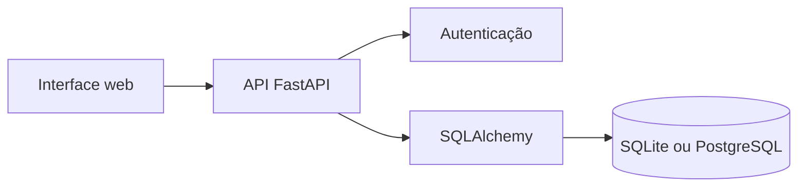

# Smart Carpool

Aplicação web para organizar caronas universitárias, desde a publicação do trajeto até a confirmação da vaga entre motorista e passageiro.

[Acessar demonstração](https://smart-carpool-7ltw.onrender.com)

> A demonstração utiliza hospedagem gratuita. Após um período sem acessos, a primeira abertura pode levar cerca de um minuto enquanto o serviço é iniciado.

## Situação do projeto

O MVP está funcional, publicado e validado com diferentes usuários. Ele foi desenvolvido a partir do UniCar, protótipo criado como Trabalho de Conclusão de Curso na UNIFAL-MG.

As contas e os dados da demonstração são fictícios. O sistema comprova os fluxos e as regras implementadas, mas não é oferecido como serviço para uso cotidiano.

## Funcionalidades

- Cadastro, autenticação e edição de perfil
- Cadastro, seleção, edição e exclusão de veículos
- Publicação e busca de caronas
- Solicitação de vaga pelo passageiro
- Aceite ou recusa pelo motorista
- Cancelamento de solicitações e caronas
- Atualização segura da quantidade de vagas disponíveis
- Painéis de viagens oferecidas, solicitadas e pedidos recebidos
- Proteção do telefone e da placa antes da confirmação da vaga
- Documentação interativa da API

## Regras e validação

O sistema impede operações que deixariam os dados inconsistentes, como excluir veículos vinculados indevidamente, ultrapassar a quantidade de vagas ou alterar solicitações de outro usuário.

Foram executados testes manuais com diferentes contas para conferir negociação de vagas, privacidade da placa, edição de perfil, regras de exclusão de veículos e controle de disponibilidade. Além disso, 18 testes automatizados cobrem autenticação, autorizações, banco de dados, veículos, solicitações, cancelamentos e privacidade dos dados.

```bash
pytest
```

## Estrutura técnica

- FastAPI, Pydantic e SQLAlchemy
- PostgreSQL no ambiente publicado e SQLite no desenvolvimento local
- Alembic para migrações
- HTML, CSS e JavaScript na interface
- Pytest e HTTPX nos testes
- GitHub Actions para executar a suíte de testes



## Executar localmente

Requer Python 3.11 ou superior.

```bash
python -m venv .venv
```

No Windows:

```powershell
.venv\Scripts\Activate.ps1
pip install -r requirements.txt
python -m alembic upgrade head
python -m app.seed
uvicorn app.main:app --reload
```

No Linux ou macOS:

```bash
source .venv/bin/activate
pip install -r requirements.txt
python -m alembic upgrade head
python -m app.seed
uvicorn app.main:app --reload
```

A aplicação fica disponível em `http://127.0.0.1:8000` e a documentação da API em `http://127.0.0.1:8000/docs`.

Contas de demonstração:

- `motorista@unifal.br` / `123456`
- `passageiro@unifal.br` / `123456`

No Windows, o arquivo `start-smart-carpool.bat` também prepara o acesso local. A interface depende da API e não deve ser aberta diretamente pelo arquivo `app/static/index.html`.

## Documentação

- [`docs/architecture.md`](docs/architecture.md): entidades e regras de vagas
- [`docs/screens.md`](docs/screens.md): evolução das telas desde o UniCar
- [`docs/roadmap.md`](docs/roadmap.md): entregas concluídas e melhorias opcionais

## Origem

Desenvolvido por Leonardo Henrique Oliveira a partir do TCC **UniCar: um aplicativo de caronas compartilhadas para a Universidade Federal de Alfenas**, realizado com Bruna Helena Antonialli Gomes, sob orientação do Prof. Dr. Luiz Felipe Ramos Turci.

Antes de qualquer uso real, seriam necessárias revisões adicionais de segurança, privacidade, moderação e operação.
