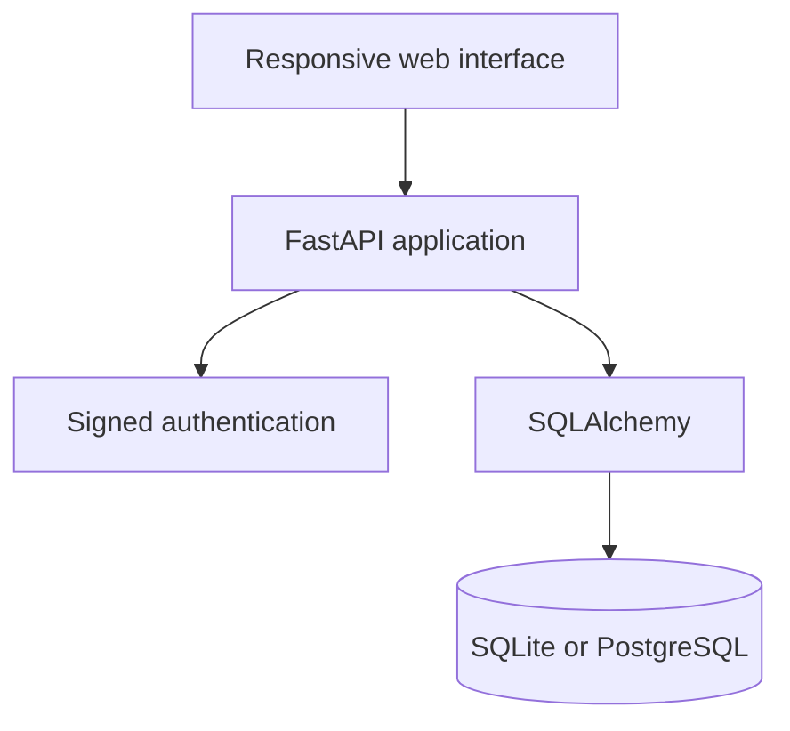

# Architecture

## Main entities

- **User:** a single identity that can offer or request rides
- **Vehicle:** belongs to a user and can be linked to offered rides
- **Ride:** a route offered by a driver using one vehicle
- **Booking:** a passenger request with a controlled status

## Seat availability rule

A seat is consumed only when the driver accepts a booking request. The API locks the selected booking for the decision, checks availability again and prevents the number of available seats from becoming negative. Rejecting or cancelling an accepted booking returns the seat to the ride.
