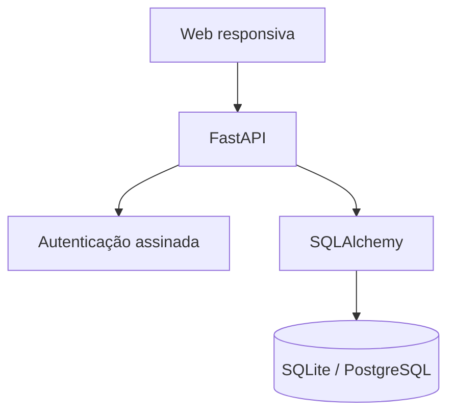

# Arquitetura

## Entidades

- User: identidade única; pode dirigir ou viajar.
- Vehicle: pertence a um usuário.
- Ride: trajeto oferecido por motorista e veículo.
- Booking: solicitação de passageiro com status.

## Regra crítica de vagas

A vaga só é consumida quando o motorista aceita a solicitação. A API bloqueia a reserva para decisão, confere a disponibilidade novamente e impede vagas negativas. Recusa ou cancelamento de uma reserva aceita devolve a vaga.

